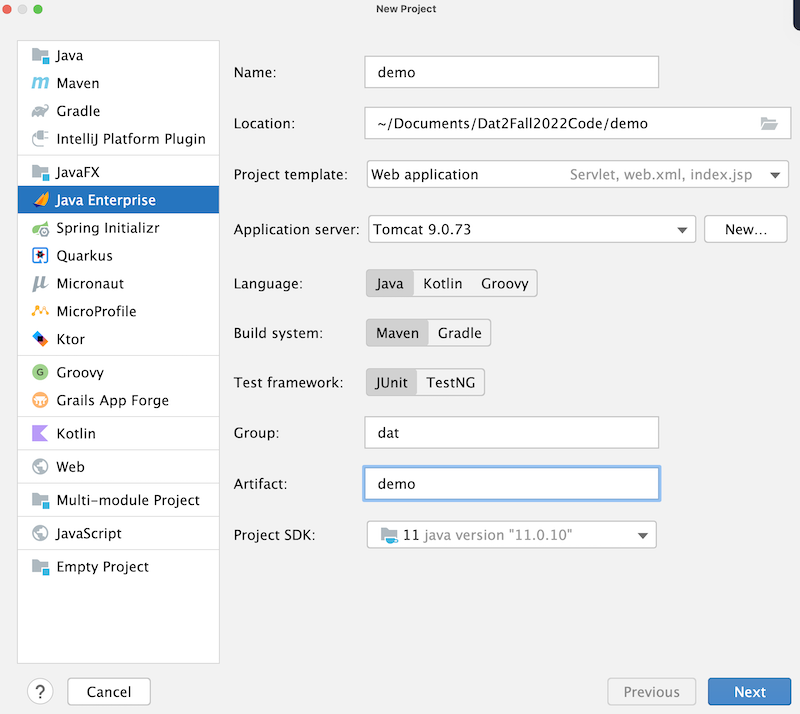

# Dokumentation
Dette er min egen dokumentation af Java Webstack.

## Start af et nyt webprojekt

1. Opret nyt projekt i IntelliJ
2. Vælg JavaEE Projekt skabelon 
3. Java + Maven 
4. Servlet Dependencies

## Arkitektur

Vi anvender en slags MVC-pattern.

- M(odel) - Entiteter og hjælpe- metoder og klasser
- V(iew) - JSP og Frontend (CSS, Bootstrap mm)
- C(ontrol) - Servlets

HUSK! Ingen kommunikation mellem model og view. Gå altid igennem controller.

## Opret Git repo

git init
git add .
git commit -m "first commit"
git remote add origin https://github.com/pelle112112/intranet.git
git push -u origin main

## 